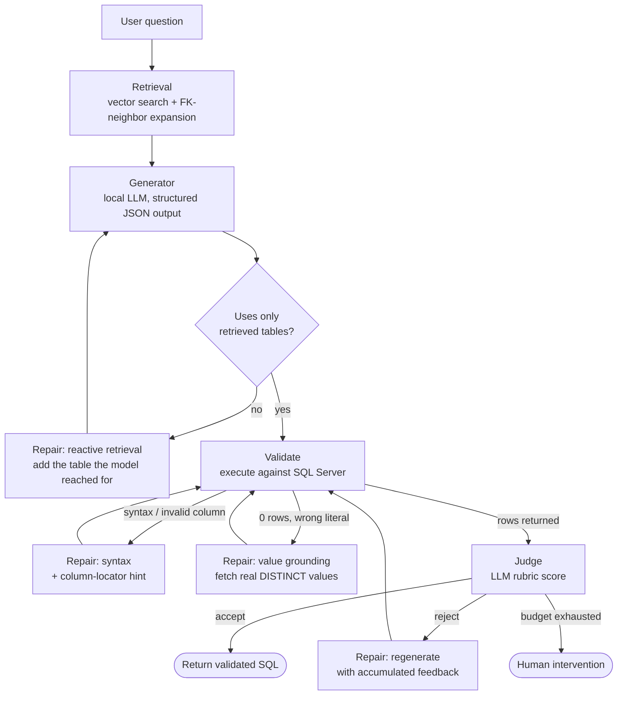

# Natural Language → SQL Generator (RAG + Self-Repair + LLM Judge)

A production-oriented natural-language-to-SQL system for an internal data-engineering team.
It converts plain-English questions into validated T-SQL against a large (70+ table)
Microsoft SQL Server database, using schema-retrieval (RAG), a self-repairing generation loop,
and an LLM judge as the final gate — with a rigorous, multi-metric evaluation harness including
a **schema-obfuscation robustness test** that measures true generalization vs. memorization.

Generator runs on a **local** model via Ollama (`granite4.1:8b`); the judge uses a hosted model
(DeepSeek). Database: `AdventureWorks2025`.

---

## Why this exists

A naive "put the whole schema in the prompt" approach works for a 10-table toy database but
collapses at 70+ tables (context blows up, retrieval noise dominates). The two hard problems this
project solves:

1. **Scale** — the model must find the *right* tables/columns out of hundreds, from a natural
   question, without the schema fitting in the prompt.
2. **Correctness you can trust** — an LLM saying "looks good" is not proof. The system is built
   around *objective, execution-based* evaluation, and is explicitly tested for whether it works
   on a schema the model has **never memorized**.

---

## Architecture

The pipeline is a **single-state state machine** (`PipelineState` + `Status` enum + a
`RepairRouter`) with **one shared retry budget** — no tangled nested retry loops. Every step is a
pure `state → state` function.



### 1. Retrieval layer (RAG over schema) — `schema.py`
- **Vector store**: ChromaDB over per-table schema documents (description + columns + FK
  relationships), embedded with `BAAI/bge-large-en-v1.5`.
- **Two-signal retrieval**: semantic similarity finds *what the question is about*; a
  **foreign-key graph** finds *what those tables are structurally connected to*. Pure similarity
  misses join-critical tables (e.g. `Person.Person`, which holds names but is textually
  unrelated to a "total sales" question) — FK-neighbor expansion recovers them.
- **FK-neighbor expansion** (`expand_with_fk_neighbors`): from the semantic seeds, walk the FK
  graph, ranking candidates by a **bridge score** (how many seeds a table connects) with a
  similarity tiebreak, and a **per-hop budget** so one hub table can't starve later hops.
  Lifted retrieval recall from **0.72 → 1.0** on the eval set.
- **Context assembled for the generator**: compact schema summary + real DDL + **FK join paths**
  (explicit `TableA.col = TableB.col` hints — see the obfuscation finding below).

### 2. Generation layer — `generator.py`
- Local Ollama model, **structured output** via a Pydantic schema (`reasoning`, `sql_query`,
  `is_vague`) with a JSON-schema retry loop.
- Temperature **0** on the first attempt (reproducible), **0.4** on repairs (so a deterministic
  model can escape a wrong fixed point instead of re-emitting the same broken query).

### 3. Validation layer — `validator.py`, `pipeline/steps.py`
- **Out-of-context-table guard**: parses the generated SQL and flags any table that wasn't
  retrieved — catching hallucinated/memorized tables *before* execution.
- **Execution** against SQL Server (SELECT-only; DROP/DELETE/UPDATE/etc. are blocked).
- **Value grounding**: a syntactically valid query returning **0 rows** often means a literal
  filter doesn't match stored data (`'HR'` vs `'Human Resources'`, `'Gray'` vs `'Grey'`). The
  system fetches the column's real `DISTINCT` values and regenerates with them.

### 4. Repair router — `pipeline/repair.py`
A single dispatch table maps each failure type to a repair strategy, all sharing one attempt
budget (default 3):

| Failure | Repair |
|---|---|
| `syntax_error` | regenerate with the real DB error + a **column-locator hint** (looks up which retrieved table actually owns the missing column) |
| `zero_rows_value_mismatch` | regenerate with the real column values |
| `out_of_context_table` | resolve the table in the catalog, add its DDL, regenerate (reactive retrieval) |
| `judge_reject` | regenerate with accumulated judge feedback |
| budget exhausted | escalate to human |

### 5. Judge layer — `judge.py`
An LLM-as-judge (DeepSeek) scores the final query against a rubric (semantic accuracy, then
efficiency) and acts as the **final logical gate**. Rejections re-enter the same repair loop.

---

## Evaluation

Correctness is measured **objectively**, not by the judge's opinion. A hand-built **40-question
benchmark** (`eval/`) spans Basic → Expert difficulty (joins, `HAVING`, correlated/nested
subqueries, window functions, CTEs, self-joins, set operations, value-repair traps), each with a
validated **gold SQL** and **gold table set**.

Three independent metrics (`evaluate.py`):

- **Retrieval recall** — did retrieval surface every table the gold query needs?
- **Execution accuracy (EX)** — run gold and generated SQL, compare **result sets**, not SQL text.
  Reported two ways:
  - **Strict-EX** — exact rows + columns.
  - **Entity-EX** — column-tolerant (forgives extra/omitted decorative columns via bidirectional
    containment) but never bridges identifier substitutions, so it can't over-accept.
  - The harness **auto-categorizes** each failure as *column-presentation* vs *genuine*.
- **LLM judge score** — kept as a metric specifically to *quantify how optimistic it is* vs. EX.

### The obfuscation robustness test (the centerpiece)

AdventureWorks is a public database, so both the generator and judge have partly **memorized**
it. To measure *true* generalization, the harness rebuilds the entire schema with **opaque names**
(`Person.Person → obf.T23`, `FirstName → col_0108`) while keeping **descriptions and data values
real**, exposed through auto-generated SQL **views** — then runs the identical pipeline in
`SCHEMA_MODE=obf`. If accuracy holds, the pipeline genuinely works from retrieval; if it drops,
the gap *is* the memorization the naive system was silently relying on.

Build scripts: `build_obf_map.py` (rename map), `build_obf_views.py` (view layer),
`build_obf_assets.py` (obf retrieval assets + vector store).

---

## Results & key findings

| Schema mode | Judge | Strict-EX | Entity-EX | Recall |
|---|---|---|---|---|
| **Real** | 0.95 | 0.775 | 0.825 | 0.975 |
| **Obfuscated, naive** | 0.70 | 0.25 | 0.25 | 0.94 |
| **Obfuscated + FK-path injection** | 0.68 | 0.45 | 0.45 | 0.94 |

What each row taught, and what was done about it:

1. **The judge is optimistic.** It scored 95% "perfect"; objective execution accuracy was 77.5%.
   The judge rubber-stamped queries that computed the wrong measure or grouped at the wrong level.
   → *This is why execution accuracy, not judge score, is the headline metric.*

2. **Obfuscation exposed heavy memorization.** With names opaque, accuracy collapsed 0.775 → 0.25
   even though **retrieval recall stayed at 0.94** — so it was a *generation*, not retrieval,
   failure. The model was joining `BusinessEntityID` to a `rowguid`, using `StandardCost` as
   "list price", `AccountNumber` as "customer id" — it had been silently relying on **memorized
   join keys and column identities**.

3. **Surfacing FK relationships recovered most of it.** The generator's context never contained
   explicit join keys. Injecting FK join-paths (metadata the system already had) nearly doubled
   obfuscated accuracy (0.25 → 0.45) and made the join logic schema-agnostic.

4. **The residual is the local 8B model's ceiling** — disambiguating opaque columns (Color vs
   Size, Gender vs MaritalStatus) from descriptions alone. This is an honestly-reported model
   capability limit, not a pipeline defect; a stronger generator or proactive column-value
   sampling would close it further.

The takeaway an interviewer cares about: *a clean 0.80 on a public database overstates real-world
performance; measuring and then closing the memorization gap is the actual engineering.*

---

## Tech stack

- **Python**, **Ollama** (`granite4.1:8b`) for local generation, **DeepSeek** for the judge
- **ChromaDB** + **sentence-transformers** (`BAAI/bge-large-en-v1.5`) for schema retrieval
- **pyodbc** → **Microsoft SQL Server** (`AdventureWorks2025`)
- **Pydantic** (structured LLM output), **sqlparse** / **sql-metadata** (SQL parsing)

## Repository layout

```
schema.py              retrieval, FK graph + expansion, compact schema / DDL / join-path context
generator.py           generator, structured output, JSON-schema retry
validator.py           SQL execution, value-grounding repair context
judge.py               LLM-as-judge
pipeline/
  state.py             PipelineState, Status enum, snapshot()
  steps.py             retrieve / generate / validate / judge  (state -> state)
  repair.py            repair strategies, RepairRouter, OOC guard, column locator
  controller.py        run_pipeline() orchestrator + finalize()
evaluate.py            eval harness: execution_match (strict), entity_match, metrics
eval/                  40-question benchmark (gold SQL + gold tables)
build_index.py         one-time vector-store ingestion (real schema)
build_obf_*.py         obfuscation harness (rename map, views, obf assets)
obf/                   obfuscated assets (map, views, summary, DDL, vector db)
runs/                  timestamped evaluation runs (JSON)
```

## Running it

```bash
# one-time: build the schema vector store
python build_index.py

# generate SQL for a question
python -c "from pipeline.controller import run_pipeline; print(run_pipeline('Which product sold the most units?'))"

# full benchmark (real schema)
python evaluate.py

# obfuscated robustness run (PowerShell)
python build_obf_map.py; python build_obf_views.py --execute; python build_obf_assets.py
$env:SCHEMA_MODE = "obf"; python evaluate.py
```

---

*Built as a deep-dive into retrieval-augmented code generation and, above all, into how to
**evaluate** it honestly — separating what a model knows from what a pipeline actually does.*
